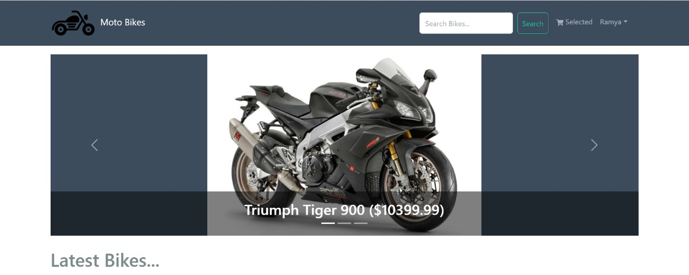
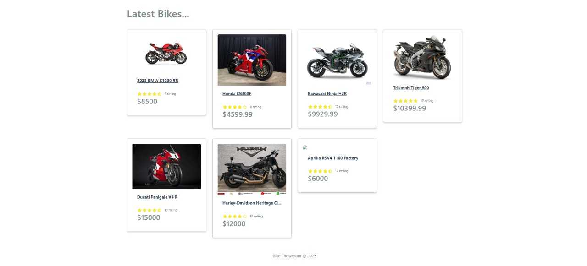
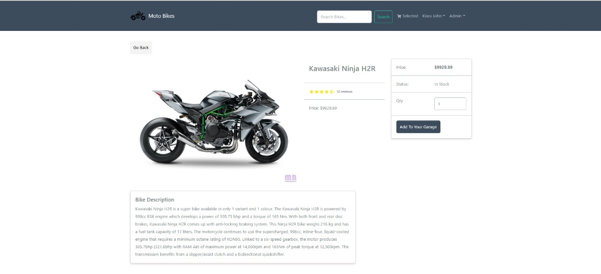
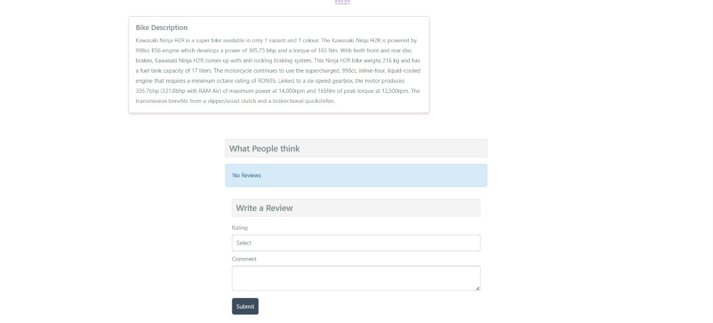
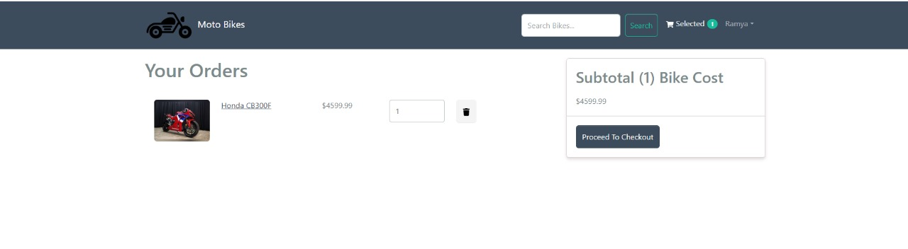
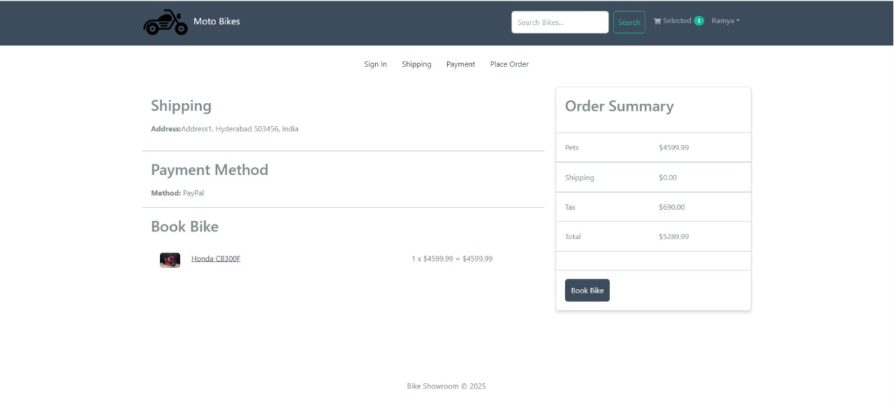

# Bike Showroom

Welcome to the Bike Showroom project! This is a full-stack application where users can browse, purchase, and manage bikes online.

## ✨ Features
- User registration and authentication (login/signup)
- Browse bikes
- Add bikes to cart and checkout
- Admin dashboard to manage products and orders
- Responsive design for mobile and desktop

## 🛠️ Tech Stack
- **Frontend:** React.js, Redux Toolkit, Bootstrap
- **Backend:** Node.js, Express.js
- **Database:** MongoDB

# Screenshots

